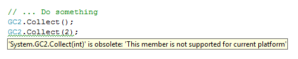

# NETStandard.WindowsCE
A library that implements the API of .NET Standard specification on Microsoft Windows CE platform.

## Getting Started
Install the [NuGet package](https://www.nuget.org/packages/NETStandard.WindowsCE/)

## How existing classes are extended

The naming of classes that extends existing types are the same but appended '2' digit, as `Activator2` and `Int322`.
Instance methods are implemented using _extension methods_ and class methods as static method.

```csharp
using System;

// Lesser disruptive way for a code that needs to be compatible
// with multiple platforms
#if !WindowsCE
using static System.Int32;
#else
using static System.Int322;
#endif

namespace Tests
{
    static class Program
    {
        static void Main(string[])
        {
            int result;
            // Calls System.Int322.TryParse for Windows CE platforms
            // or calls System.Int32.TryParse for others
            if (!TryParse("123", NumberStyles.None, null, out result))
                System.Console.WriteLine("Could not parse provided string");
            else
                System.Console.WriteLine("The provided string could be parsed");
            
            const string text = "Lorem ipsum dolor sit amet";
            string croppedText = text.Remove(11);	// <-- Extension method
            System.Console.WriteLine("The text after processing: {0}", croppedText);
        }
    }
}
```

## How not supported API are marked

The API that is not supported on Microsoft Windows CE platform throw `PlatformNotSupportedException` exception when called
and are marked as deprecated using `ObsoleteAttribute` attribute.


